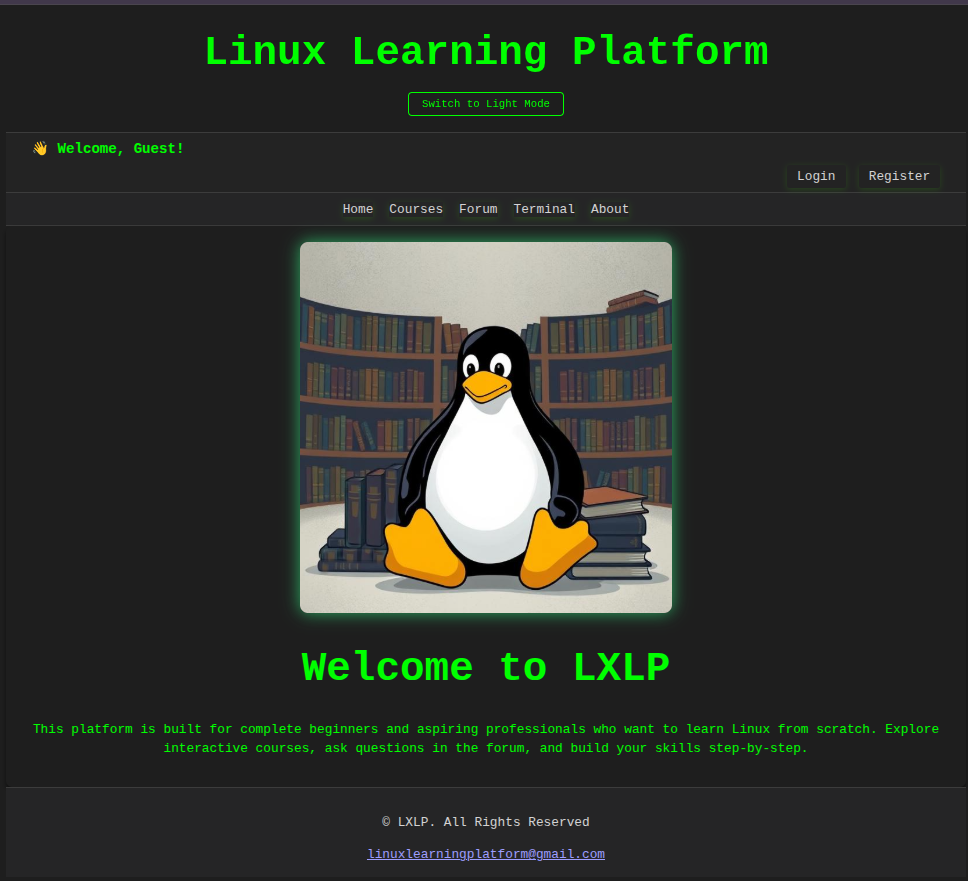

# FullstackProject - LXLP (Linux Learning Platform)

## Table of Contents

- [About](#about)
- [Features](#features)
- [Usage](#usage)
- [Contributing](#contributing)
- [License](#license)
- [Contact](#contact)

## About

Linux Learning Platform (LXLP) is an open-source web application designed to help users learn Linux concepts and commands through interactive tutorials, quizzes, and hands-on labs.

## Features

- Interactive Linux tutorials
- Command-line practice environment
- Progress tracking and achievements
- Quizzes and assessments
- Community discussion forums

## Usage

- Access the platform at `www.linuxlearningplatform.me`
- Register for an account and start learning Linux!

## License

This project is licensed under the MIT License. See [LICENSE](LICENSE) for details.

## Contact

For questions or feedback, open an issue or contact [linuxlearningplatform@gmail.com](mailto:linuxlearningplatform@gmail.com).